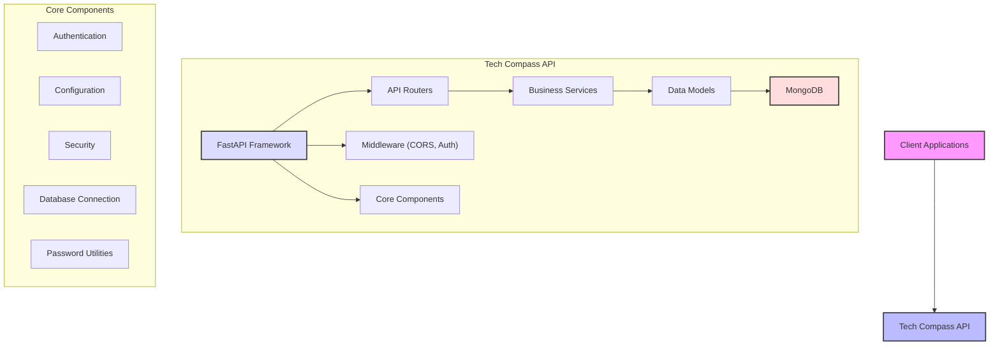
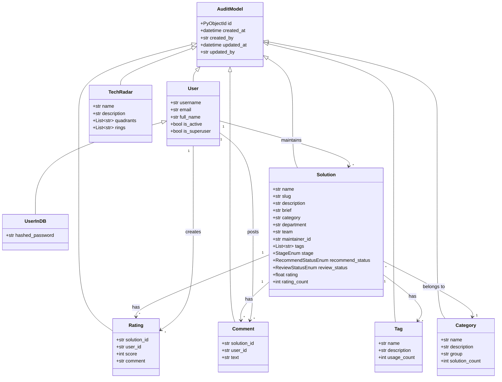
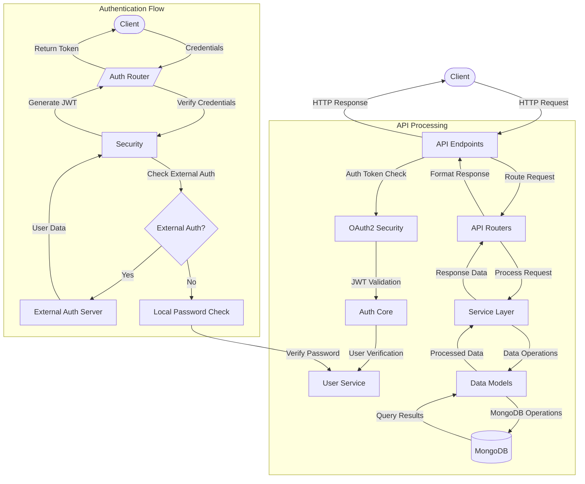
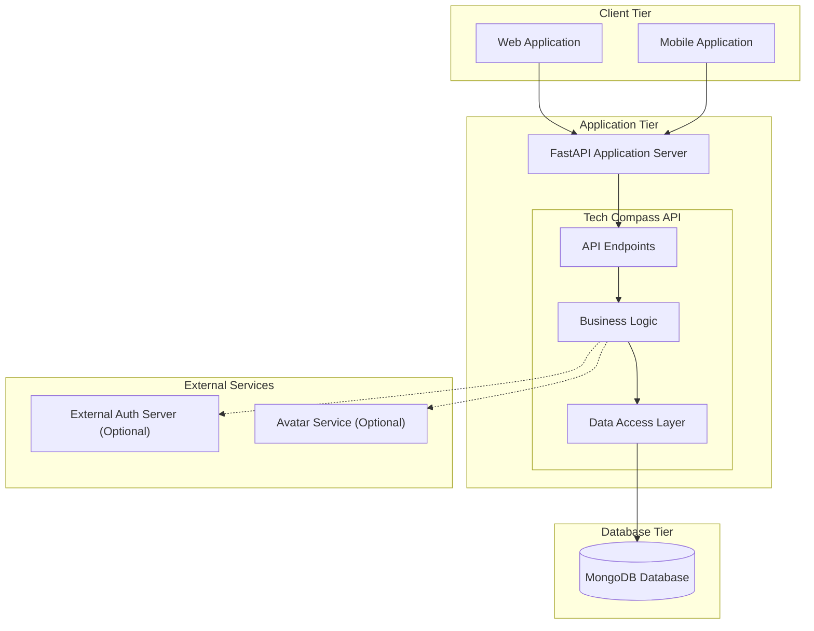
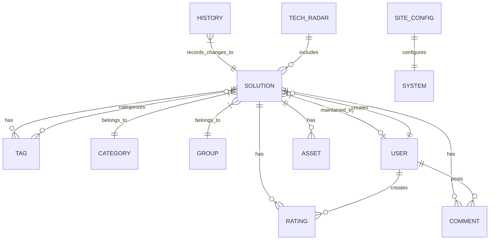
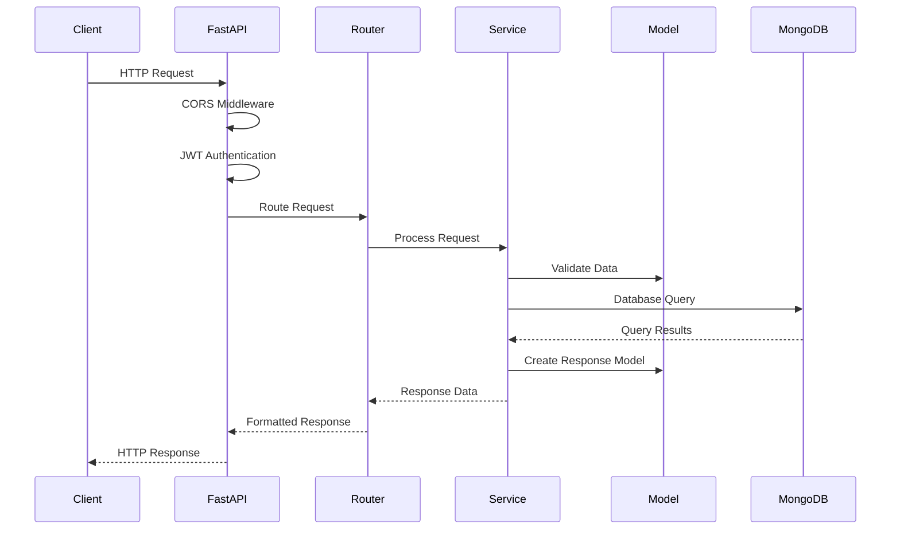
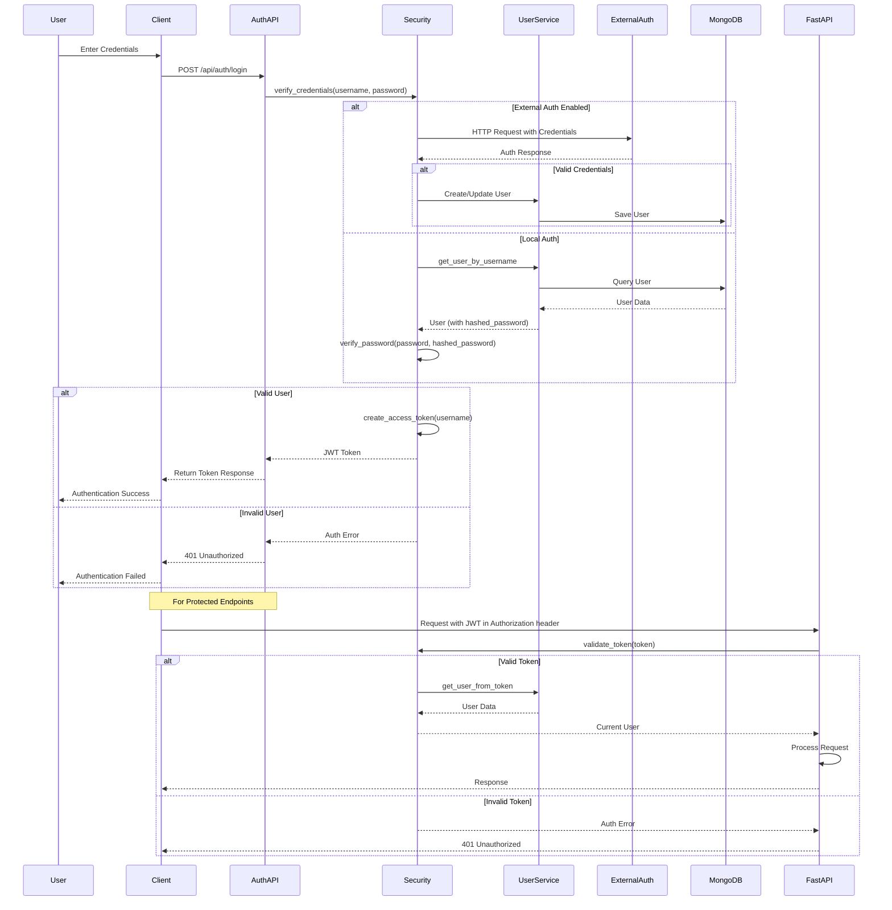

# Tech Compass API Architecture Diagrams

This document provides various architectural views of the Tech Compass API system using component diagrams based on the actual codebase.

## 1. High-Level System Architecture

This diagram shows the high-level system architecture of the Tech Compass API, including the major components and their relationships.

## 2. Component Interaction Diagram

```mermaid
flowchart TD
    subgraph Client["Client"]
        WebUI["Web UI"]
        MobileApp["Mobile App"]
    end

    subgraph TechCompassAPI["Tech Compass API"]
        FastAPI["FastAPI App"]
        CORS["CORS Middleware"]

        subgraph Routers["API Routers"]
            AuthRouter["Auth Router"]
            SolutionsRouter["Solutions Router"]
            UsersRouter["Users Router"]
            TagsRouter["Tags Router"]
            RatingsRouter["Ratings Router"]
            CommentsRouter["Comments Router"]
            CategoriesRouter["Categories Router"]
            GroupsRouter["Groups Router"]
            AssetsRouter["Assets Router"]
            TechRadarRouter["Tech Radar Router"]
            HistoryRouter["History Router"]
            SiteConfigRouter["Site Config Router"]
        end

        subgraph Services["Services"]
            UserService["User Service"]
            SolutionService["Solution Service"]
            TagService["Tag Service"]
            RatingService["Rating Service"]
            CommentService["Comment Service"]
            CategoryService["Category Service"]
            AssetService["Asset Service"]
            TechRadarService["Tech Radar Service"]
            GroupService["Group Service"]
            HistoryService["History Service"]
            SiteConfigService["Site Config Service"]
        end

        subgraph Core["Core Components"]
            Security["Security"]
            Auth["Auth"]
            Config["Config"]
            MongoDBConnection["MongoDB Connection"]
            Password["Password Utilities"]
        end

        subgraph Models["Data Models"]
            CommonModels["Common Models"]
            SolutionModel["Solution Models"]
            UserModel["User Models"]
            TagModel["Tag Models"]
            CategoryModel["Category Models"]
            CommentModel["Comment Models"]
            RatingModel["Rating Models"]
            ResponseModel["Response Models"]
        end
    end

    subgraph Database["Database"]
        MongoDB[(MongoDB)]
    end

    WebUI --> FastAPI
    MobileApp --> FastAPI
    FastAPI --> CORS
    CORS --> Routers

    AuthRouter --> Security
    AuthRouter --> UserService
    UsersRouter --> UserService
    SolutionsRouter --> SolutionService
    TagsRouter --> TagService
    RatingsRouter --> RatingService
    CommentsRouter --> CommentService
    CategoriesRouter --> CategoryService
    GroupsRouter --> GroupService
    AssetsRouter --> AssetService
    TechRadarRouter --> TechRadarService
    HistoryRouter --> HistoryService
    SiteConfigRouter --> SiteConfigService

    UserService --> UserModel
    SolutionService --> SolutionModel
    TagService --> TagModel
    RatingService --> RatingModel
    CommentService --> CommentModel
    CategoryService --> CategoryModel

    UserService --> MongoDBConnection
    SolutionService --> MongoDBConnection
    TagService --> MongoDBConnection
    RatingService --> MongoDBConnection
    CommentService --> MongoDBConnection
    CategoryService --> MongoDBConnection
    AssetService --> MongoDBConnection
    TechRadarService --> MongoDBConnection
    GroupService --> MongoDBConnection
    HistoryService --> MongoDBConnection
    SiteConfigService --> MongoDBConnection

    MongoDBConnection --> MongoDB

    Security --> Auth
    Auth --> UserService
    Security --> Password

    Auth --> Config
    MongoDBConnection --> Config
```

This diagram illustrates the detailed component interactions within the Tech Compass API, showing how different routers, services, and models interact with each other and the database.

## 3. Model Relationships

This class diagram shows the data model relationships in the Tech Compass API, focusing on the inheritance from the AuditModel base class and the associations between various entities.

## 4. API Data Flow

This diagram illustrates the flow of data through the API, including the authentication process with support for both local authentication and external authentication servers.

## 5. Deployment Architecture

This diagram shows how the Tech Compass API would be deployed across different tiers in a production environment, including optional external services for authentication and avatars.

## 6. API Resource Relationships

This entity-relationship diagram depicts the relationships between the different resources exposed by the Tech Compass API.

## 7. API Request-Response Cycle

This sequence diagram illustrates the request-response cycle for a typical API call in the Tech Compass system, including middleware processing and authentication.

## 8. Authentication Flow

This detailed sequence diagram shows the authentication flow, including both local and external authentication options, token generation, and validation for protected endpoints.
