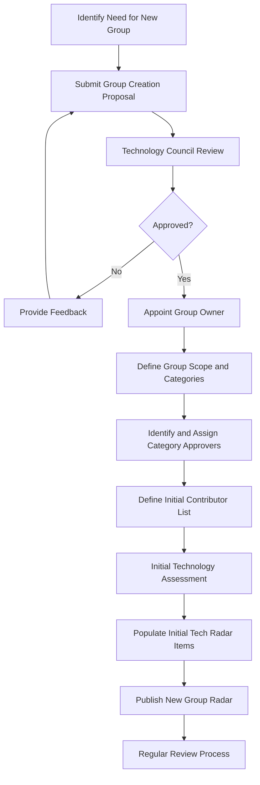
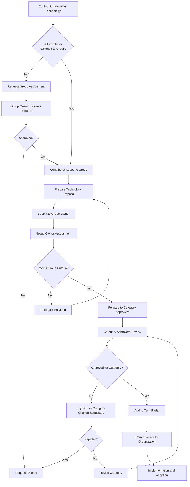
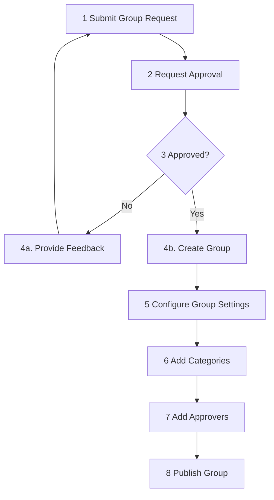
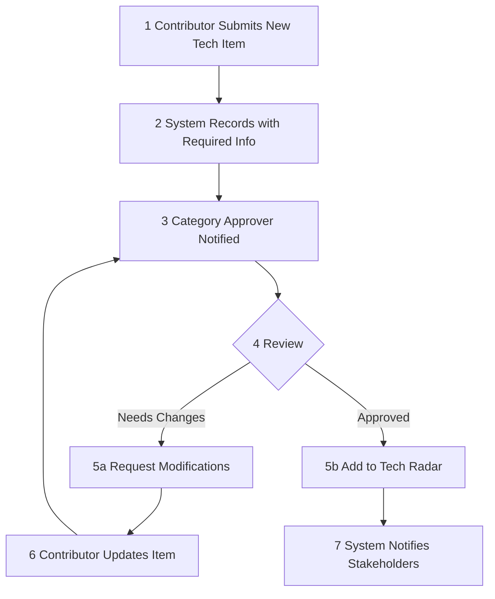
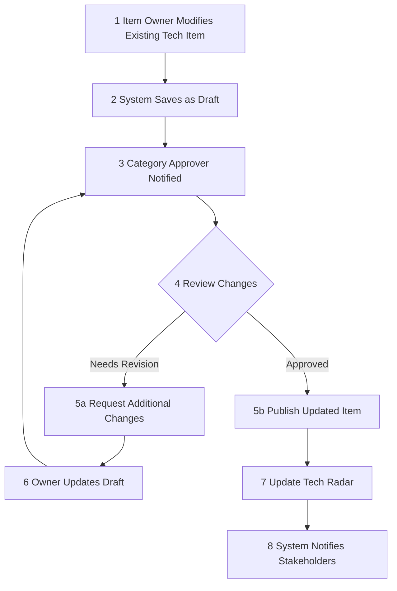

# Tech Radar Governance Process

## Overview

This document outlines the governance process for our technology radar, focusing on group-based management of technologies. The process ensures that technology decisions are made collaboratively, with clear ownership and accountability.

## Governance Structure

### Roles and Responsibilities

#### 1. Technology Council

- **Composition**: CTO, Enterprise Architects, and Senior Technical Leaders
- **Responsibilities**:
  - Establish overall tech radar framework and policies
  - Resolve cross-group technology conflicts
  - Review and approve significant technology changes
  - Final authority for technology decisions
  - Assign Category Approvers and Group Owners

#### 2. Group Owners

- **Composition**: Technical leads or architects assigned to specific technology groups
- **Responsibilities**:
  - Manage the technologies within their assigned group
  - Review and assess new technology proposals for their group
  - Recommend changes to technology status (adopt, assess, hold, retire)
  - Ensure alignment with organizational strategy
  - Conduct regular reviews of their group's technologies
  - Manage group contributor membership

#### 3. Category Approvers

- **Composition**: Subject matter experts assigned to one or more technology categories
- **Responsibilities**:
  - Final approval authority for technology items within their assigned categories
  - May be assigned to multiple categories based on expertise
  - Ensure consistent standards across technology items in their categories
  - Collaborate with Group Owners on cross-category technologies

#### 4. Technology Contributors

- **Composition**: Engineers, developers, and other technical staff assigned to specific groups
- **Requirements**:
  - Must be assigned to one or more specific groups before contributing
  - Can only propose and provide feedback on technologies within their assigned groups
- **Responsibilities**:
  - Propose new technologies for consideration within their assigned groups
  - Provide experience reports and feedback on existing technologies
  - Participate in technology assessments
  - Implement adopted technologies

## Technology Groups and Categories

### Technology Groups

The tech radar is organized into the following groups, each with a dedicated owner:

1. **Languages & Frameworks**
2. **Tools**
3. **Platforms & Infrastructure**
4. **Techniques & Practices**

Additional groups may be created as needed to address specific domains.

### Technology Categories

Within each group, technologies are further classified into categories:

1. **Adopt**: Approved for production use
2. **Trial**: Approved for limited use with supervision
3. **Assess**: Under evaluation, not ready for production
4. **Hold**: Not recommended for new projects
5. **Retire**: To be phased out

Each category has one or more designated approvers who validate technology placements.

## Governance Process

### 1. Contributor Assignment

1. Team members must be assigned to one or more technology groups before they can contribute
2. Group assignments are managed by Group Owners and approved by the Technology Council
3. Assignment is based on expertise, role, and organizational needs
4. Contributors can request to join additional groups by providing justification

### 2. Technology Proposal

1. Contributors can only propose technologies within their assigned groups
2. Proposals must be submitted to the relevant Group Owner
3. Proposals must include:
   - Technology name and description
   - Business justification
   - Potential benefits and risks
   - Evaluation criteria and results
   - Implementation considerations
   - References or case studies
   - Recommended category placement

### 3. Group Assessment

1. Group Owners review proposals within their domain
2. Assessment includes:
   - Technical evaluation
   - Strategic alignment
   - Risk assessment
   - Resource requirements
   - Impact analysis
3. Group Owners may:
   - Request more information
   - Organize proof of concept
   - Consult with other groups for cross-cutting concerns
   - Involve subject matter experts

### 4. Category Approval

1. Group Owners forward approved proposals to the appropriate Category Approvers
2. Category Approvers review the technology against category-specific criteria
3. A technology must receive approval from all assigned Category Approvers
4. Category Approvers may:
   - Approve the technology for the recommended category
   - Suggest a different category placement
   - Request additional information or evaluation
   - Reject the proposal with justification

### 5. Publication and Implementation

1. Approved technologies are published to the tech radar in their appropriate category
2. Group Owners are responsible for:
   - Communicating changes to their teams
   - Supporting adoption of new technologies
   - Monitoring implementation and usage
   - Collecting feedback

### 6. Regular Review

1. Group Owners conduct quarterly reviews of their technology portfolio
2. Reviews include:
   - Usage statistics
   - Experience reports
   - Issue tracking
   - Market developments
   - Emerging alternatives
3. Based on reviews, Group Owners may recommend category changes
4. Category changes require approval from the relevant Category Approvers

## Process Diagrams

### Process for Building a New Tech Radar Group

### Process for Contributing and Approving a Tech Item

### Simplified Implementation: Creating a New Tech Radar Group

### Simplified Implementation: New Tech Item Submission

### Simplified Implementation: Modifying Existing Tech Item

## Conflict Resolution

1. Conflicts within a group are resolved by the Group Owner
2. Conflicts between groups are escalated to the Technology Council
3. Conflicts between Group Owners and Category Approvers are escalated to the Technology Council
4. The Technology Council has final decision authority

## Governance Metrics

The effectiveness of the governance process is measured by:

1. Time from proposal to decision
2. Adoption rate of approved technologies
3. Business impact of technology decisions
4. Team satisfaction with the process
5. Contributor participation across groups

## Document Maintenance

This governance process document is reviewed annually by the Technology Council and updated as needed.
